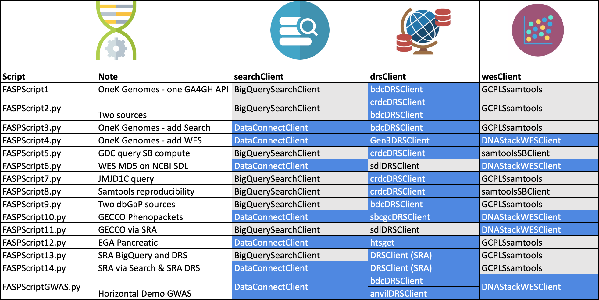

# fasp-scripts
 Scripts and clients for GA4GH Federated Analysis Systems Project

[TOC]

------

Script summary

### **Prerequisites to run**

- Python 3
  - See the code for the modules required
- A folder in your home directory called .keys containing keys for various services. Not all  keys required for all scripts.
  - BDCcredentials.json - api_key file [obtained from BioDataCatalyst](https://gen3.biodatacatalyst.nhlbi.nih.gov/identity)
  - CRDCAPIKey.json - api_key file [obtained from Cancer Research Data Commons](https://nci-crdc.datacommons.io/identity)
  - anvil_credentials.json - api_key file [obtained from Anvil](https://gen3.theanvil.io)
  - sevenbridges_keys.json - keys for cgc and or cavatica
- The following modules are used by different scripts. All scripts are unlikely to be relevant to all users these modules are not installed with the fasp package. Please install those needed for the scripts you will run.
  - Google Life Sciences API enabled for your GCP account
  - BigQuery python libraries - for scripts that use BigQuery
  - [pyega3](https://pypi.org/project/pyega3/) - EGA client libraries for download. See also [EGA documentation for client API](https://ega-archive.org/download/downloader-quickguide-APIv3). 

------

#### Thousand Genomes FASP - FASPScript4.py

This script queries Thousand Genomes data on subjects and specimens which was exported from BioDataCatalyst and loaded into BigQuery.

- [FASPScript4](https://github.com/ga4gh/fasp-scripts/blob/master/fasp/scripts/FASPScript4.py) uses the following GA4GH APIs to perform each step
   - Discovery Search Server (DNA Stack) - Presto on BigQuery
   - DRS server (BioDataCatalyst)
   - WES Server (DNA Stack)
fasp-scripts/blob/master/fasp/scripts
The other two scripts were proof of concept using direct APIs from different stacks
 - [FASPScript1](https://github.com/ga4gh/fasp-scripts/blob/master/fasp/scripts/FASPScript1.py) uses BigQuery for the query and directly submits a GCP Life Sciences pipeline for the compute. This compute uses samtools stats.
 - [FASPScript3](https://github.com/ga4gh/fasp-scripts/blob/master/fasp/scripts//FASPScript3.py) is the same as but substitutes in public DNAStack Discovery Search server for search

- Possible to do's

  - Troubleshoot samtools stats workflow on DNAStack WES server 

#### GWAS workflow 

Script: [FASPScriptGWAS.py](https://github.com/ga4gh/fasp-scripts/blob/master/fasp/scripts/FASPScriptGWAS.py)

- Queries Discovery Search for Thousand Genomes non-annotated recalibrated vcf file for Chromosome 21, obtaining prefixed DRS ids for the file. 
- Resolves which DRS server needs to be called to obtain a URL to access the file.
- Submits the GWAS WDL workflow to the DNAStack WES Server using the URL provided by DRS.

#### Demonstration of Search and compute from multiple sources 

Script: [FASPScript2.py](https://github.com/ga4gh/fasp-scripts/blob/master/fasp/scripts//FASPScript2.py)

- Query COPDGene data in BigQuery, exported from BioDataCatalyst via PFB.

- Query TCGA data in the ISB-CGC tables in BigQuery,

- Both queries use an appropriate prefix to identify which DRS server should be called to obtain a url to the file.

  Currently submits directly to a GCP Life Sciences pipeline. This will be substituted by a submission to a WES Server.

  Both datasets are controlled access data. Access is controlled by the respective Fence access tokens on the CRDC and BioDataCatalyst DRS servers. The COPD data in BigQuery is under GCP IAM access control.

- Possible to do's

  - Add additional dbGaP datasets.
  - Move query to Discovery Search - requires access control on Discovery Search.

#### Reproducibility across stacks 

Script: [FASPScript8.py](https://github.com/ga4gh/fasp-scripts/blob/master/fasp/scripts/FASPScript8.py)

- Queries TCGA data via BigQuery to obtain DRS ids
- Uses DRS to identify files for these cases are on both Google Cloud and AWS
- Runs samtools stats on Google Cloud and Seven Bridges (AWS)

#### Compute on SRA (NCBI Sequence Read Archive) urls 

Script: [FASPScript6.py](https://github.com/ga4gh/fasp-scripts/blob/master/fasp/scripts/FASPScript6.py)

- This script demonstrates that the DNAStack WES Server can perform a compute on the urls returned by the SRA Data Locator. The SDL is a place holder for the NCBI DRS service.
- A checksum was computed by the DNAStack WES implementation on the sra format file for which a URL could be obtained. Though GetObject showed there are BAM files with an access_id of gs.us URLs to these could not be obtained.
- Possible to do's

  - Substitute in SRA DRS server
  - Identify why BAM file URLS are not returned by SDL.

####  JMJD1C variants - 

Script: [FASPScript7.py](https://github.com/ga4gh/fasp-scripts/blob/master/fasp/scripts/FASPScript7.py)

- Uses the ISB-CGC BigQuery tables to query for subjects from TCGA with variants in the JMJD1C gene.  This is the gene in the example shared by Anne Deslattes Mays. This illustrates the kind of query that could be used for the workflows Anne wants to perform.

- Possible to do's

    - Substitute in SRA DRS server
    
    - Identify other GA4GH data sources that might contain relevant data for this disease.

####  Simulate identifiers.org/n2t.net 

Script: [DRSMetaResolver.py](https://github.com/ga4gh/fasp-scripts/blob/master/fasp/loc/DRSMetaResolver.py)

- Simulates how compact identifier prefixing can be used to redirect DRS GetObject calls to the relevant DRS Server.
- Possible to do's

  - Do trial registration with nt2/identifers of DRS server prefixes

------

### **Clients used in above examples**

### **Search clients**

#### DiscoverySearchClient.py

Wrapper to call the DNAStack DiscoveryClient and return results of a query.

#### BigQuerySearchClient

Perform searches via BigQuery

------

### **DRS and 'DRS-like' clients**

#### DRSClient.py

Superclass for DRS Clients

#### **Gen3DRSClient.py**

This is a python wrapper for the two DRS functions. It also handles Gen3 authentication using Fence. This is necessary until RAS/Passport support is in place.

There are two clients for specific Gen3 DRS servers

- **crdcDRSClient** - client for Cancer Research Data Commons DRS server
- **bdcDRSClient** - client for BioDataCatalyst DRS server

#### SBDRSClient.py

A DRS client for Seven Bridges DRS services. Handles SB specific authentication. Two specific classes are provided.

- **sbcgcDRSClient** - client for Seven Bridges Cancer Genomics Cloud DRS server 
- **cavaticaDRSClient**  - client for Cavatica DRS Server

#### sdlDRSClient.py

A DRS-like wrapper around the SRA Data Locator. Uses standard dbGaP/SRA authentication (.ngc file)

------

### Workflow clients

#### DNAStackWESClient.py

Wrapper to make a WES call. Currently does an MD5 checksum, plan is to use samtools and eventually a GWAS workflow. 

#### **GCPLSsamtools.py**

Wrapper to prepare a job to run samtools as a GCP Life Sciences pipeline. 

#### SBsamtools.py

Submits a samtools stats task via Seven Bridges API

#### WESClient.py

Superclass for WES clients

------

### **Workflow support**

checksum.wdl - a simple workflow for testing WES submission - calculates a checksum

More to be added

#### Other demos and tests

**testSearchPagination.py** - demonstrates how Discovery Seach query results are returned over several pages

**examples** - examples of using individual APIs used in the main examples 

