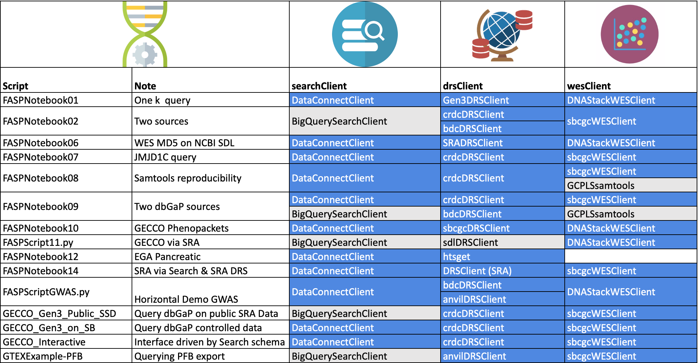

# 
 These are the Jupyter notebooks for GA4GH Federated Analysis Systems Project

These supersede the scripts used in the FASP-Scripts used at GA4GH Plenary 2020. 

[TOC]

------

## FASPScripts Notebooks

. 

The notebooks follow a basic three step pattern used throughout FASP. Each step corresponds to a different GA4GH API as outlined here

- Search - to identify subjects and samples of interest based on attrinutes of those subjects and samples
- Data Repository Service DRS - to obtain authorized access to files (genomic sequences)
- Workflow Execution Service - WES -  to perform a workflow on those files

In any notebook more than one implementation of the given API may be used at each step where different data sources need to be searched, where files are in different cloud locations, or where workflow needs to be performed local to those files.

Some notebooks use a non GA4GH API which performs equivalent functionality. The motivation for each notebook was to search particular datasets together in a federated way. Where those data were not available through a GA4GH API a proprietary API was used. In some cases the data sources used in notebooks were created for purposes of demo/exploration. In some cases this was necessary to create scrambled versions of controlled access datasets. In other cases controlled access subject and specimen data were searched but were accessed from private stores maintained under access control.

In all cases where controlled access sequence data was used it remains under the access control of the repositories that make it available (EGA, NIH Cloud Platforms).

The table below indicates for each notebook where a GA4GH API could be used (blue) and where a proprietary API (grey) was used.

### **Prerequisites to run notebooks

- fasp package - install (e.g. pip) from fasp-scripts directory
- Settings file
  - The examples directory contains a template settings file with a number of parameters for the FASP scripts. Place a copy of this file in your file system and set the environment variable FASP_SETTINGS to point to it. Edit the settings as appropriate.
- Python 3
  - See the code for the modules required
- A folder in your home directory called .keys containing keys for various services. Not all  keys required for all scripts.
  - A summary of key naming and where to obtain the keys is [available here](../fasp/docs/access_keys.md).
- The following modules are used by different scripts. All scripts are unlikely to be relevant to all users these modules are not installed with the fasp package. Please install those needed for the scripts you will run.
  - Google Life Sciences API enabled for your GCP account
  - BigQuery python libraries - for scripts that use BigQuery
  - Seven Bridges API
  - [pyega3](https://pypi.org/project/pyega3/) - EGA client libraries for download. See also [EGA documentation for client API](https://ega-archive.org/download/downloader-quickguide-APIv3). 

------

