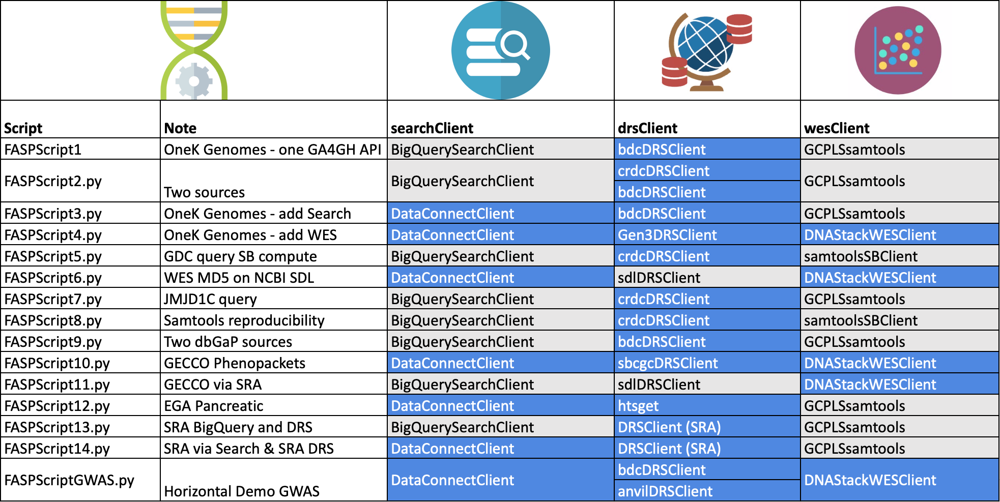

# 
 These are the scripts for GA4GH Federated Analysis Systems Project

[TOC]

------

## Horizontal Demo

The materials for the Horizontal Demo from the GA4GH 2020 Plenary are under plenary-resources-2020. That folder contains  the files necessary for the workflow used by each of the four platforms participating in the Horizontal Demo. See  the 

[ReadMe]: ./plenary-resources-2020/README.md

in that directory for details.  for more details.

## FASPScripts

These Python scripts were originally created for the Cross-Platform Demo at the 2020 Plenary. Additional scripts have been added as additional data sources and GA4GH implementations have become available. 

They follow a basic three step pattern used throughout FASP. Each step corresponds to a different GA4GH API as outlined here

- Search - to identify subjects and samples of interest based on attrinutes of those subjects and samples
- Data Repository Service DRS - to obtain authorized access to files (genomic sequences)
- Workflow Execution Service - WES -  to perform a workflow on those files

In any script more than one implementation of the given API may be used at each step where different data sources need to be searched, where files are in different cloud locations, or where workflow needs to be performed local to those files.

Some scripts use a non GA4GH API which performs equivalent functionality. The driver for each script was to search particular datasets together in a federated way. Where those data were not available through a GA4GH API a proprietary API was used. In some cases the data sources used in scripts were created for purposes of demo/exploration. In some cases this was necessary to create scrambled versions of controlled access datasets. In other cases controlled access subject and specimen data were searched but were accessed from private stores maintained under access control.

In all cases where controlled access sequence data was used it remains under the access control of the repositories that make it available (EGA, NIH Cloud Platforms).

The table below indicates for each script where a GA4GH API could be used (blue) and where a proprietary API (grey) was used.

### **Prerequisites to run scripts**

- fasp package - install (e.g. pip) from fasp-scripts directory
- Settings file
  - The examples directory contains a template settings file with a number of parameters for the FASP scripts. Place a copy of this file in your file system and set the environment variable FASP_SETTINGS to point to it. Edit the settings as appropriate.
- Python 3
  - See the code for the modules required
- A folder in your home directory called .keys containing keys for various services. Not all  keys required for all scripts.
  - bdc_credentials.json - api_key file [obtained from BioDataCatalyst](https://gen3.biodatacatalyst.nhlbi.nih.gov/identity)
  - crdc_credentials.json - api_key file [obtained from Cancer Research Data Commons](https://nci-crdc.datacommons.io/identity)
  - anvil_credentials.json - api_key file [obtained from Anvil](https://gen3.theanvil.io)
  - sevenbridges_keys.json - keys for cgc and or cavatica
- The following modules are used by different scripts. All scripts are unlikely to be relevant to all users these modules are not installed with the fasp package. Please install those needed for the scripts you will run.
  - Google Life Sciences API enabled for your GCP account
  - BigQuery python libraries - for scripts that use BigQuery
  - Seven Bridges API
  - [pyega3](https://pypi.org/project/pyega3/) - EGA client libraries for download. See also [EGA documentation for client API](https://ega-archive.org/download/downloader-quickguide-APIv3). 

------

### Thousand Genomes FASP - FASPScript4.py

This script queries Thousand Genomes data on subjects and specimens which was exported from BioDataCatalyst and loaded into BigQuery.

- [FASPScript4](https://github.com/ga4gh/fasp-scripts/blob/master/fasp/scripts/FASPScript4.py) uses the following GA4GH APIs to perform each step
   - Discovery Search Server (DNA Stack) - Presto on BigQuery
   - DRS server (BioDataCatalyst)
   - WES Server (DNA Stack)
fasp-scripts/blob/master/fasp/scripts
The other two scripts were proof of concept using direct APIs from different stacks
 - [FASPScript1](https://github.com/ga4gh/fasp-scripts/blob/master/fasp/scripts/FASPScript1.py) uses BigQuery for the query and directly submits a GCP Life Sciences pipeline for the compute. This compute uses samtools stats.
 - [FASPScript3](https://github.com/ga4gh/fasp-scripts/blob/master/fasp/scripts//FASPScript3.py) is the same as but substitutes in public DNAStack Discovery Search server for search

- Possible to do's

  - Troubleshoot samtools stats workflow on DNAStack WES server 

### GWAS workflow 

Script: [FASPScriptGWAS.py](https://github.com/ga4gh/fasp-scripts/blob/master/fasp/scripts/FASPScriptGWAS.py)

- Runs the same workflow as the Horizontal Demo
- Queries Discovery Search for Thousand Genomes non-annotated recalibrated vcf file for Chromosome 21, obtaining prefixed DRS ids for the file. 
- Resolves which DRS server needs to be called to obtain a URL to access the file.
- Submits the GWAS WDL workflow to the DNAStack WES Server using the URL provided by DRS.

### Demonstration of Search and compute from multiple sources 

Script: [FASPScript2.py](https://github.com/ga4gh/fasp-scripts/blob/master/fasp/scripts//FASPScript2.py)

- Query COPDGene data in BigQuery, exported from BioDataCatalyst via PFB.

- Query TCGA data in the ISB-CGC tables in BigQuery,

- Both queries use an appropriate prefix to identify which DRS server should be called to obtain a url to the file.

  Currently submits directly to a GCP Life Sciences pipeline. This will be substituted by a submission to a WES Server.

  Both datasets are controlled access data. Access is controlled by the respective Fence access tokens on the CRDC and BioDataCatalyst DRS servers. The COPD data in BigQuery is under GCP IAM access control.

- Possible to do's

  - Add additional dbGaP datasets.
  - Move query to Discovery Search - requires access control on Discovery Search.

### Reproducibility across stacks 

Script: [FASPScript8.py](https://github.com/ga4gh/fasp-scripts/blob/master/fasp/scripts/FASPScript8.py)

- Queries TCGA data via BigQuery to obtain DRS ids
- Uses DRS to identify files for these cases are on both Google Cloud and AWS
- Runs samtools stats on Google Cloud and Seven Bridges (AWS)

### Compute on SRA (NCBI Sequence Read Archive) urls 

Script: [FASPScript6.py](https://github.com/ga4gh/fasp-scripts/blob/master/fasp/scripts/FASPScript6.py)

- This script demonstrates that the DNAStack WES Server can perform a compute on the urls returned by the SRA Data Locator. The SDL is a place holder for the NCBI DRS service.
- A checksum was computed by the DNAStack WES implementation on the sra format file for which a URL could be obtained. Though GetObject showed there are BAM files with an access_id of gs.us URLs to these could not be obtained.
- Possible to do's

  - Substitute in SRA DRS server
  - Identify why BAM file URLS are not returned by SDL.

###  JMJD1C variants - 

Script: [FASPScript7.py](https://github.com/ga4gh/fasp-scripts/blob/master/fasp/scripts/FASPScript7.py)

- Uses the ISB-CGC BigQuery tables to query for subjects from TCGA with variants in the JMJD1C gene.  This is the gene in the example shared by Anne Deslattes Mays. This illustrates the kind of query that could be used for the workflows Anne wants to perform.

- Possible to do's

    - Substitute in SRA DRS server
    
    - Identify other GA4GH data sources that might contain relevant data for this disease.

------

## **Workflow support**

checksum.wdl - a simple workflow for testing WES submission - calculates a checksum

More to be added

## Other demos and tests

**testSearchPagination.py** - demonstrates how Discovery Seach query results are returned over several pages

**examples** - examples of using individual APIs used in the main examples 

